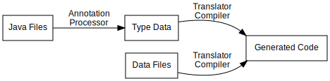
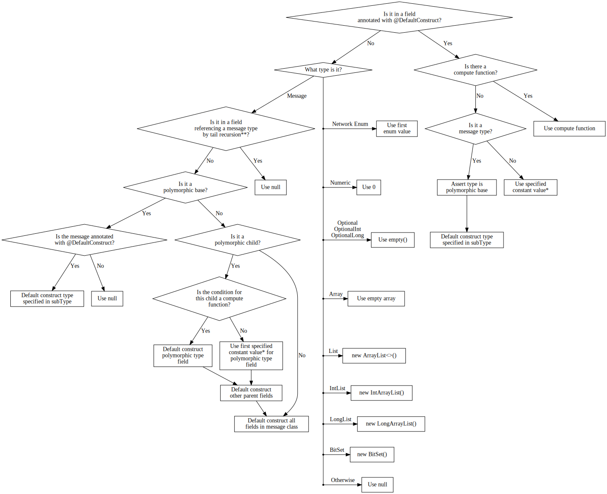
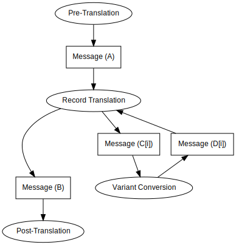

# Translator Compiler
The majority of the translation in multiconnect is done by code generated by the translator compiler. The translator compiler takes two inputs: the CSV files in the `data` directory, and annotations in the multiconnect source code.



## Messages
A message variant is a unit of data that is sent over the network. Packets are a type of message, as are structs inside a packet.

Message variants are defined as classes annotated with the `@MessageVariant` annotation. They must have one or more *record fields*, which are public non-static non-final fields inside the message class, and must be constructible via a no-arg constructor (unless it's a [polymorphic parent](#polymorphism)). A message is serialized by serializing each of its record fields in sequence. Message variants do not allow recursion in their data structure, except for [tail recursion](#tail-recursion) in limited cases.

There may be multiple message variants for a message, which represents different versions of a message for different Minecraft versions. A message is an interface annotated with `@Message`. See [message variants](#message-variants).

### Record Field Types
A record field must have one of the following types:

- Primitive type
- `String`
- A message type
- A message variant type
- A [network enum](#network-enums)
- `UUID`
- `Identifier`
- `NbtCompound`
- `OptionalInt`
- `OptionalLong`
- `IntList`
- `LongList`
- `BitSet`
- `Optional`, `List` or array of any valid record field type

### Wire Types
A field additionally has a *wire type*, which specifies how the field is serialized on the wire. Most types have their own wire type, but it's worth noting that ints and longs default to using varint and varlong respectively as their wire types. You can change the wire type of a field with the `@Type` annotation.

Optional types are serialized by default has a boolean, followed by the wire type if the boolean was true. List types are serialized by default using a varint to specify the length, followed by that number of repetitions of the wire type.

The way list type lengths are serialized and calculated can be customized using the `@Length` annotation. You can change the wire type of the length, or specify a [multiconnect function](#multiconnect-functions) to compute the length from preceding fields, or specify a constant value for the length.

A field of type `byte[]` may be annotated with `@RemainingBytes` to override the normal length computation and fill the byte array with all remaining bytes in the ByteBuf.

### Conditions using `@OnlyIf`
You can specify a [multiconnect function](#multiconnect-functions) which returns a boolean for whether a field annotated with `@OnlyIf` is present or should be skipped.

### Polymorphism
Polymorphism is the primary way to introduce a choice of how to deserialize subsequent data. All polymorphic types are annotated with `@Polymorphic`. They consist of a *polymorphic base*, which is an abstract `@MessageVariant` class, and *polymorphic subclasses* which extend the polymorphic base. Only one layer of inheritance is allowed - no grandchild classes are allowed.

The polymorphic subclass to deserialize to is determined by the *polymorphic type field*, which is the first record field in the polymorphic base. Each polymorphic subclass specifies a condition on this field for whether that subclass should be used. This can be specified in the form of one or more [constants](#constants), or as [multiconnect function](#multiconnect-functions) conditions, or using a catch-all `otherwise = true` clause.

Sometimes, the polymorphic type field may be specified earlier in the packet, rather than directly prior to the polymorphic message variant. In this case, you may use the `@PolymorphicBy` annotation on the record field referencing the polymorphic type, and specify the record field from which to take the value of the polymorphic type field.

### Tail Recursion
Normally messages are not allowed to be recursive, except for tail recursion. Tail recursion is allowed in two cases:

- In a non-polymorphic message variant type with `tailrec = true` in the `@MessageVariant` annotation, the last field of the message may have the type of the message variant itself. The last field must be annotated with [`@OnlyIf`](#conditions-using-onlyif) in this case.
- In a polymorphic subclass where the polymorphic base has `tailrec = true` in the `@MessageVariant` annotation, the last field of the subclass may have the type of the polymorphic base. There must be at least one polymorphic subclass of the polymorphic base which either does not have a tail recursive field or has a tail recursive field annotated with [`@OnlyIf`](#conditions-using-onlyif).

### Multiconnect Functions
Multiconnect functions are public static methods in the same class from which they are referenced. These functions must be unique by name within the class, i.e. multiconnect functions do not support overloading. The translator compiler will generate calls to these functions, typically on the network thread, so be mindful of potential threading issues inside these functions.

Multiconnect functions have a *context message variant*, which unless otherwise specified by the documentation for the place the function is referenced, is the message variant the function is referenced from.

The return type of multiconnect functions can vary, and requirements depend on where the function is used. In some situations, you may be required to return a list of objects (e.g. packets) which may not all have the same type, but the types must be known at compile time. If all the objects are known to be of type `MyType`, then you may simply return `List<MyType>`. Otherwise, you can return a `List<Object>` and annotate the method with the repeatable `@ReturnType` annotation to specify the possible return types.

Multiconnect functions may have the following types of parameters:

- Positional parameters: parameters without a multiconnect annotation, before any other parameters. Unless otherwise specified by the documentation for the place the function is referenced, multiconnect functions do not allow any positional parameters.
- Context parameters: parameters annotated with `@Argument`. Passes the value of a field from the context message variant. The annotation specifies the name of the record field to pull from.
- Default constructed parameters: parameters annotated with `@DefaultConstruct`. The translator compiler will generate code to construct an instance of the type of the parameter as per [default construction](#default-construction), and pass the instance in. If the parameter type is a `Supplier`, then the generated code will instead pass a `Supplier` which creates a new default-constructed instance of the supplied type on each invocation of `get()`.
- Filled parameters: parameters annotated with `@Filled`. A value is passed into this parameter by the generated code depending on its type. Supported types are:
  - `ClientPlayNetworkHandler` - passes the current network handler.
  - `TypedMap` - passes a typed map for user data that's valid from when the packet was sent/received until it is handled. This holder remains valid for the packets returned from a packet's handler, if any.
  - `Identifier` and integral types - if the `@Filled` annotation has a `fromRegistry` attribute, then the parameter is filled with the string or numeric identifier for the registry entry specified.
  - `DelayedPacketSender<T>` - passes a function appropriate for sending a packet of type `T` (either to the client or to the server) from within a multiconnect function. Multiconnect functions should *not* send packets through alternative means such as `PacketSystem.sendToClient`. This is because registry IDs are *untranslated* inside multiconnect functions, but `PacketSystem.sendTo*` assumes that IDs have already been translated. Note that the preferred way to send packets from a `@Handler` in the same direction as the incoming packet is to return the packet(s) from the function.
- Global data parameters: parameters annotated with `@GlobalData`. Global data can hold one instance per type and is valid for the duration of a connection. If the parameter is of type `Consumer<T>` then it is a setter to the global instance of type `T`. Otherwise if the parameter is of type `T`, then it gives read-only access to the global instance of type `T`. This instance *must* be treated as immutable because it may be accessed by multiple translator workers at the same time. The only valid way to modify global data is via `Consumer<T>`.

### Network Enums
Network enums are simply enums annotated with the `@NetworkEnum` annotation. They must have at least one value. Record fields with a network enum type are serialized as if they were ints.

### Constants
Whenever a constant value is required in an annotation, the annotation has the following attributes:

- `booleanValue`
- `intValue`
- `doubleValue`
- `stringValue`

All of these are arrays defaulting to empty, except `booleanValue` which defaults to false. `intValue` actually takes a long array. If one constant is expected, the arrays must have a maximum length of 1.

Depending on the expected type of the constant, one of these annotation attributes is expected to be used:

| Type | Constant |
|---|---|
| `boolean` | `booleanValue` |
| Integral field annotated with `@Registry` | `stringValue`, converted as if by `registry.getRawId(registry.get(new Identifier(value)))` |
| Integral | `intValue` |
| `float`, `double` | `doubleValue` |
| `String` | `stringValue` |
| `Identifier` | `stringValue`, converted as if by `new Identifier(value)` |
| Network enum `T` | `stringValue`, converted as if by `T.valueOf(value)` |

No other types are supported for constant values.

### Default Construction
Translator types have default ways of being default constructed:

\* - see [constants](#constants).  
\*\* - see [tail recursion](#tail-recursion).

## Message Translation
Message translation is defined between two versions. Let's call these versions *A* and *B*, so that the message is being translated from version *A* to version *B*. If *A* < *B*, then the message must be clientbound (an smessage), and if *A* > *B*, then the message must be serverbound (a cmessage).

### Message Variants

A message may have one or more *variants*. A variant is the structure of a message for a particular version range. A message must have variants that support all versions that multiconnect supports, between the message's minimum supported version and its maximum supported version. To translate a message from *A* to *B*, it is required that both *A* and *B* are within the supported range of the message.

If a message variant implements an interface, that interface shall be the message that the message variant is a variant of. If a message variant does not implement an interface, there is an implicit message type whose only variant is that message variant.

If there are multiple variants of a message, each message variant should declare the version range it supports by setting the `minVersion` and `maxVersion` attributes in the `@MessageVariant` annotation. If the `minVersion` attribute is absent, then it defaults to the minimum version that multiconnect supports. If the `maxVersion` attribute is absent, then it defaults to the newest version that multiconnect supports. It is an error for multiple variants of the same message to support the same version. It is an error for a message variant to declare support for a version without being used on that version.

### Translation Steps

The message is translated from *A* to *B* in the following phases:



where *C* is the version closest to *B* supported by the variant which supports *A*, and *D* is the version closest to *A* supported the variant which supports *B*.

Record Translation is the process of translating all record fields of the message from *A* to *C* or from *D* to *B*. Record fields which are themselves messages are translated as per the normal message translation strategy, except without the pre-translation and post-translation steps. All other record fields are left untouched.

Variant Conversion is the process of converting the message between two adjacent variants, from the variant that supports *A* up until the variant that supports *B*. This is the most complex part of translation and deserves a separate category.

Pre- and Post-Translation applies recursively on this message and all messages contained in its record fields. Pre-Translation only applies in the clientbound direction on packets received from the server before they are translated. Post-Translation only applies in the serverbound direction on packets before they are sent to the server after they have been translated. These steps are used for [registry translation](#registry-translation).

### Variant Conversion
A variant conversion converts between *adjacent* versions *X* to *Y*, where the message variant that supports *X* is different from the variant which supports *Y*.

There must be a way to fill in every record field in the *Y* variant. There are two ways to fill in a field:

- Automatic transfer - take the value from a record field with the same name in the *X* variant. This value may be coerced if necessary.
  - All primitive types can be coerced to each other by a simple type cast.
  - Container types (optionals, lists and arrays) can be coerced in the natural way if the element type is coercible.
  - Lists and arrays can be coerced to each other.
  - Two message variant types which are variants of the same message may be coerced using message translation without pre- and post-translation.
  - If the type is the same but the wire type is different, then variant conversion causes the field to be decoded and recoded if it wasn't otherwise. This includes the length of a list or array.
  - If the type is the same but the type is a message (interface), then each type is treated as if it were the variant implementation for the corresponding versions, which may include the need for a conversion.
- Introduction - annotating a field with `@Introduce` allows you to specify custom logic for what to fill this field with. You can set a [constant value](#constants), fill the field with a [default constructed](#default-construction) value, or specify a custom [multiconnect function](#multiconnect-functions) to compute the value to fill. Unlike most other multiconnect functions, the *context message variant* of this function will be message variant *X*, not message variant *Y*, allowing you to use values from removed fields.

It is okay if a field in message variant *X* is not used for filling message variant *Y*. Such fields will simply be ignored and removed. 

### Registry Translation
Registry translation may occur on raw IDs or on `Identifier` IDs. Most IDs are known at compile time. The exception is multiconnect-added entries representing entries that were removed in vanilla. These entries are registered at game start and raw IDs may change when joining a singleplayer world or when joining a Fabric server due to Fabric registry sync. `Identifier` IDs and raw IDs of vanilla entries are never dynamic in this way.

Registry translation occurs on all fields annotated with `@Registry`. Additionally, DFU fixers can be applied in the registry translation phase with the `@Datafix` annotation, and a custom function can be used using the `@CustomFix` annotation.

## Packets
Packets undergo normal [message translation](#message-translation), in addition to a few extra things. This section details those extra things.

Packets are not allowed to be polymorphic.

The list of packets for each version is defined in `data/<version>/cpackets.csv` for serverbound packets and `data/<version>/spackets.csv` for clientbound packets. These files define the packet ID in that version, followed by the [message variant class](#messages) for the packet on that version. 
- For every supported server version, a clientbound [buffer translator](#buffer-translators) is generated for every spacket that servers of that version might send (every packet in that version's spackets file). 
- For every supported server version, a serverbound [buffer translator](#buffer-translators) is generated for every cpacket that clients of the latest version might send (every packet in the latest version's cpackets file).
- For every spacket annotated with a `@Sendable` annotation, [explicit translators](#explicit-translators) are generated. See [`@Sendable`](#sendable).

### Packet Handlers
Every packet must have some way of being handled. There are two ways that a packet can be handled.

- Fallthrough - the packet is translated into the target version and serialized into the ByteBuf (if it was even deserialized in the first place). This type of handling is implicit and requires no explicit markers.
- Explicit handlers - a [multiconnect function](#multiconnect-functions) annotated with `@Handler` in any packet class along the chain will be called instead of the packet being translated past the version the handler is declared in. The handler may return `void` for no further processing, or it may return a packet type from the next version in the chain and continue translating from there, or finally it may return a list of such packets, which will be translated and handled in order (the possible return types must be known at compile time, see [multiconnect functions](#multiconnect-functions) for how to do this for multiple types). The handler may also be marked with a protocol. This specifies the minimum server version (for spackets) or maximum server version (for cpackets) that this handler is applied on. Otherwise it is ignored.

### Partial Packet Handlers
In addition to handlers, packets may also have partial handlers which don't stop further translation of the packet. Partial handlers are [multiconnect functions](#multiconnect-functions) annotated with `@PartialHandler` in the packet classes. They are called as the packet is translated past the version they are defined for.

### `@Sendable`
A packet is *sendable* if it is annotated with the `@Sendable` annotation. Such packets can be sent explicitly from other areas of multiconnect code, as well as from within the translation code, by constructing an instance of the packet class and running it through the [explicit translator](#explicit-translators). Packets can be sent to either the current client or to the server.

Sendable packets declare one or more versions they can be sent in. These versions must be supported by that message variant.

- For sendable cpackets, an explicit translator is generated for every supported server version less than or equal to the declared sendable version. The packet can't be sent when the actual server version is greater than the version the packet is sent in.
- For sendable spackets, a single explicit translator is generated to translate the packet to the latest version.

## Optimization

### Buffer Translators
A buffer translator takes a buffer as input and gives a buffer as output. All the fields directly or indirectly required for translation are read from the buffer, and the rest are directly copied as raw data from the input buffer to the output buffer.

For recursive objects where only its record fields need translating, the pattern looks like:
```java
boolean condition;
do {
    // read record fields
    condition = ...;
} while (condition);
```

For recursive objects where the object itself is required, the read pattern looks like:
```java
// if non-polymorphic
MyObject rootObj = new MyObject();
// else
int polymorphicFieldType = readVarInt(buf);
MyObject rootObj = switch (polymorphicFieldType) {
    case 0 -> ...;
    case 1 -> ...;
        ...
    default -> throw ...;
}
rootObj.polymorphicFieldType = polymorphicFieldType;
//endif
MyObject obj = rootObj;
while (true) {
    // read record fields to obj
    if (condition) {
        // if non-polymorphic
        MyObject nextObj = new MyObject();
        // else
        int polymorphicFieldType = readVarInt(buf);
        MyObject nextObj = switch (polymorphicFieldType) {
            case 0 -> ...;
            case 1 -> ...;
                ...
            default -> throw ...;
        }
        nextObj.polymorphicFieldType = polymorphicFieldType;
        //endif
        obj.next = nextObj;
        obj = nextObj;
    } else {
        break;
    }
}
```

And the write pattern looks like:
```java
MyObject obj = rootObj;
do {
    // write record fields of obj
    obj = obj.next;
} while (obj != null);
```

### Explicit Translators
Explicit translators take a message object as input and output a buffer. It is mostly the same as buffer translator, except that all fields are already read, so no direct copying is allowed.
